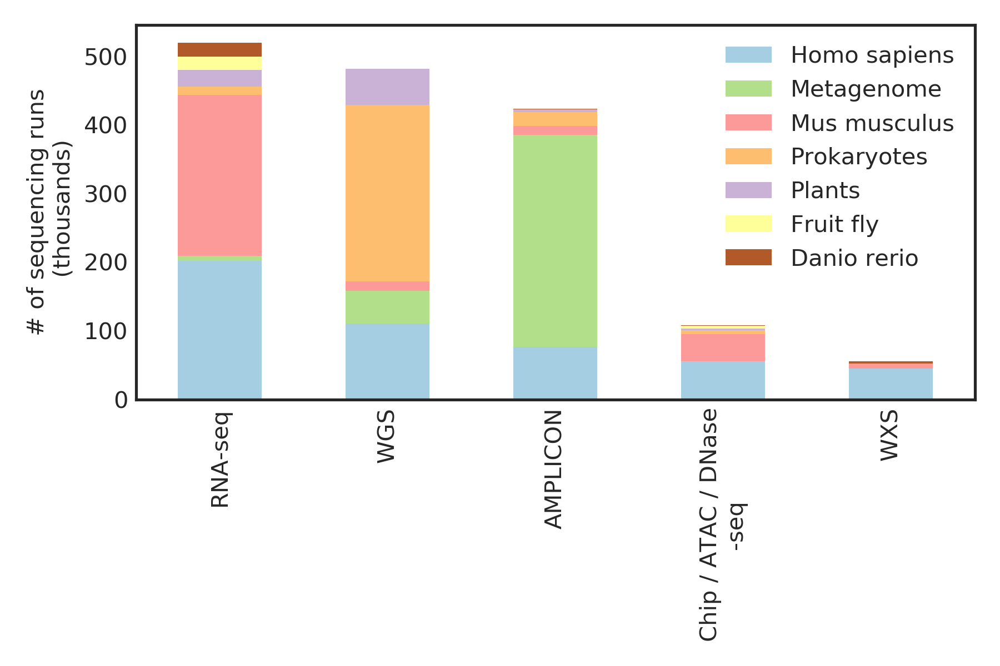

# In short
Skymap is a standalone database that offers: 
1. **a single data matrix** for each omic layer for each species that [spans >200k sequencing runs from all the public studies](https://www.ncbi.nlm.nih.gov/sra), which is done by reprocessing **petabytes** worth of sequencing data. Here is how much published data are out there: 


2. **a biological metadata file** that describe the relationships between the sequencing runs and also the keywords extracted from over **3 million** freetext annotations using NLP. 
3. **a techinical metadata file** that describe the relationships between the sequencing runs. 


**Where they can all fit into your personal computer.**

**If you intend to run the examples, please first download the data from here:** 
* https://www.synapse.org/skymap (take < 3 minutes to set up the account). 


# More examples on using simple code to analyze big data


## High resolution mouse developmental hierachy map
[jupyter notebook link](https://github.com/brianyiktaktsui/Skymap/blob/master/jupyter-notebooks/clean_notebooks/TemporalQuery_V4_all_clean.ipynb
)

Aggregating many studies (node) to form a smooth mouse developmental hierachy map. By integrating the vast amount of public data, we can cover many developmental time points, which sometime we can see a more transient expression dynamics both across tissues and within tissues over developmental time course. 

Each componenet represent a tissue. Each node represent a particular study at a particular time unit. The color is base on the developmental time extracted from experimental annotation using regex. The node size represent the # of sequencing runs in that particulr time point and study. Each edge represent a differentiate-to or part-of relationship.

And you can easily overlay gene expression level on top of it. As an example, Tp53 expression is known to be tightly regulated in development. Let's look at the dynamic of Tp53 expression over time and spatial locations in the following plot.


## Locating  SNP and correlating with different data layers
[jupyter notebook link](https://github.com/brianyiktaktsui/Skymap/blob/master/FindStudiesWithBrafV600Mutated.ipynb)
## Simple RNAseq data slicing and hypothesis testing
https://github.com/brianyiktaktsui/Skymap/blob/master/DataSlicingExample.ipynb

[Check here for more example notebooks](https://github.com/brianyiktaktsui/Skymap/tree/master/jupyter-notebooks
)

The code for the pipelines is here:
https://github.com/brianyiktaktsui/Skymap/tree/master/code

Skymap is still in Beta V0.0. [Please feel free to leave comments](https://www.synapse.org/#!Synapse:syn11415602/discussion/default) and suggestions!!! We would love to hear feedbacks from you.
## Acknowledgement


Please considering citing if you are using Skymap. (doi:10.7303/syn11415602)

Acknowledgement: We want to thank for the advice and resources from Dr. Hannah Carter (my PI), Dr. Jill Mesirov,Dr. Trey Ideker and Shamin Mollah. We also want to thank Dr. Ruben Arbagayen, Dr. Nate Lewis for their suggestion. 
The method will soon be posted in bioarchive. Also, we want to thank the Sage Bio Network for hosting the data. We also thank to thank the NCBI for holding all the published raw reads at  [Sequnece Read Archive](https://www.ncbi.nlm.nih.gov/sra). 
Grant money that make this work possible: NIH DP5OD017937,GM103504

Term of use: Use Skymap however you want. Just dont sue me, I have no money. 

For why I named it Skymap, I forgot.

## Data format and coding style

The storage is in python pandas pickle format. Therefore, the only packges you need to load in the data is numpy and pandas, the backbone of data analysis in python. We keep the process of data loading as lean as possible. Less code means less bugs and less errors. For now, Skymap is geared towards ML/data science folks who are hungry for the vast amount of data and ain't afraid of coding. I will port the data to native HDF5 format to reduce platform dependency once I get a chance. 

I tried to keep the code and parameters to be lean and self-explanatory for your reference. 


## Methods
If you want to better understand the NLP platform, I have another github page for the NLP explanation: 
* [Deep biomedical named  NLP engine](https://github.com/brianyiktaktsui/DEEP_NLP)

If you want to understand meta-analyisis using RNAseq and extracted metadata, I have written an manuscript that kinda explain that: 
* [legacy Skymap for RNAseq and using Metamap as NLP engine](https://docs.google.com/document/d/1_nES7vroX7lCwf5NSNBVZ1k2iubYm5wLeFqusq5aZuk) 


# update pipeline

If you happen to want to make a copy of the pipeline, you probably want to be be more careful about it. 

### TO UPDATE SRA META DATA


|Steps | Code| Input description|Input dir|Output description|Output dir| Timing|
|---- | ----| ----|----|----|----| ----|
|download SRA metadata | ./Pipelines/Update_SRA_meta_data/pull_SRA_meta.ipynb|none, download from web||SRA meta data| /nrnb/users/btsui/tmp/SRA_META/| 30 mins|
|parse SRA metadata | ./SRA_META/SRAManager.py |  SRA files in XML formats|/nrnb/users/btsui/tmp/SRA_META/| list of pandas series containing list of (SRS,attribute, freetext) | /cellar/users/btsui/Data/nrnb01_nobackup/tmp/METAMAP//splittedInput_SRAMangaer_SRA_META/| 20 mins
|merge SRA metadata | ./SRA_META/SRAmerge.py | list of pandas series containing list of (SRS,attribute, freetext) |/cellar/users/btsui/Data/nrnb01_nobackup/tmp/METAMAP//splittedInput_SRAMangaer_SRA_META/(allSRS.pickle,allSRX.pickle) |all SRA SRS biospecieman annotation in allSRS.pickle and allSRX.pickle  | /cellar/users/btsui/Data/nrnb01_nobackup/METAMAP/ | 10 mins| 


```python
!jupyter nbconvert --to markdown README.ipynb
!git add README.md ./jupyter-notebooks/clean_notebooks/*
!git commit -m "updated: README"
!git push 
```

    [NbConvertApp] Converting notebook README.ipynb to markdown
    [NbConvertApp] Writing 15932 bytes to README.md
    [master 653eb72] updated: README
     1 file changed, 61 insertions(+), 4 deletions(-)
    warning: push.default is unset; its implicit value has changed in
    Git 2.0 from 'matching' to 'simple'. To squelch this message
    and maintain the traditional behavior, use:
    
      git config --global push.default matching
    
    To squelch this message and adopt the new behavior now, use:
    
      git config --global push.default simple
    
    When push.default is set to 'matching', git will push local branches
    to the remote branches that already exist with the same name.
    
    Since Git 2.0, Git defaults to the more conservative 'simple'
    behavior, which only pushes the current branch to the corresponding
    remote branch that 'git pull' uses to update the current branch.
    
    See 'git help config' and search for 'push.default' for further information.
    (the 'simple' mode was introduced in Git 1.7.11. Use the similar mode
    'current' instead of 'simple' if you sometimes use older versions of Git)
    
    Counting objects: 3, done.
    Delta compression using up to 96 threads.
    Compressing objects: 100% (3/3), done.
    Writing objects: 100% (3/3), 848 bytes | 0 bytes/s, done.
    Total 3 (delta 1), reused 0 (delta 0)
    remote: Resolving deltas: 100% (1/1), completed with 1 local object.
    remote: This repository moved. Please use the new location:
    remote:   git@github.com:brianyiktaktsui/Skymap.git
    To git@github.com:brianyiktaktsui/AllPipes.git
       ab2f88f..653eb72  master -> master


|Steps | Code| Input description|Input dir|Output description|Output dir| Timing|
|---- | ----| ----|----|----|----| ----|
|calculate the SNP for extraction | ./Pipelines/snp/calculate_unprocessed.py


```python
!jupyter nbconvert --to markdown README.ipynb
!git add README.md
!git commit -m "updated: README"
!git push 
```

    [NbConvertApp] Converting notebook README.ipynb to markdown
    [NbConvertApp] Writing 5841 bytes to README.md
    [master 511e331] updated: README
     1 file changed, 5 insertions(+), 8 deletions(-)
    warning: push.default is unset; its implicit value has changed in
    Git 2.0 from 'matching' to 'simple'. To squelch this message
    and maintain the traditional behavior, use:
    
      git config --global push.default matching
    
    To squelch this message and adopt the new behavior now, use:
    
      git config --global push.default simple
    
    When push.default is set to 'matching', git will push local branches
    to the remote branches that already exist with the same name.
    
    Since Git 2.0, Git defaults to the more conservative 'simple'
    behavior, which only pushes the current branch to the corresponding
    remote branch that 'git pull' uses to update the current branch.
    
    See 'git help config' and search for 'push.default' for further information.
    (the 'simple' mode was introduced in Git 1.7.11. Use the similar mode
    'current' instead of 'simple' if you sometimes use older versions of Git)
    
    Counting objects: 3, done.
    Delta compression using up to 96 threads.
    Compressing objects: 100% (2/2), done.
    Writing objects: 100% (3/3), 355 bytes | 0 bytes/s, done.
    Total 3 (delta 1), reused 0 (delta 0)
    remote: Resolving deltas: 100% (1/1), completed with 1 local object.
    To git@github.com:brianyiktaktsui/AllPipes.git
       b063c6e..511e331  master -> master


```python
#! gdc-client --version
```


```python
#!unzip Skymap_legacy-master.zip
```
