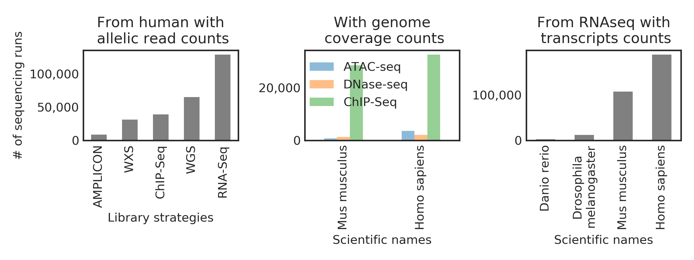

**Feel free to contact me at  **: btsui@eng.ucsd.edu  (I will try to reply within 3 days)

# Summary

Skymap is a standalone database aim that offers: 
1. **a single data matrix** for each omic layer for each species that spans >200k sequencing runs from all the public studies, which is done by reprocessing **petabytes** worth of sequencing data. Here is how much data we have reprocessed from the  SRA: 

2. **a biological metadata file** that describe the relationships between the sequencing runs and also the keywords extracted from over **3 million** freetext annotations using NLP. 
3. **a techinical metadata file** that describe the relationships between the sequencing runs. 

For examples, all the variant data can all the interpolated like this: 

**Where they can all fit into your personal computer.**

**If you intend to run the examples, please first download the data from here:** 
* https://www.synapse.org/skymap (take < 3 minutes to set up the account). 

Part of this work was presented on ISMB 2018: https://github.com/brianyiktaktsui/Skymap/blob/master/ISMB_poster_Skymap.pdf
# Examples: simple code to analyze big data

## Locating  variant and correlating with RNAseq and metadata
This is probably the best example that give you an idea on how to go from data slicing in Skymap to basic data analysis. 
[jupyter notebook link](https://github.com/brianyiktaktsui/Skymap/blob/master/XGS_WGS/FindStudiesWithBrafV600Mutated.ipynb)

## High resolution mouse developmental hierachy map
[jupyter notebook link](https://github.com/brianyiktaktsui/Skymap/blob/master/jupyter-notebooks/clean_notebooks/TemporalQuery_V4_all_clean.ipynb
)

Aggregating many studies (node) to form a smooth mouse developmental hierachy map. By integrating the vast amount of public data, we can cover many developmental time points, which sometime we can see a more transient expression dynamics both across tissues and within tissues over developmental time course. 

Each componenet represent a tissue. Each node represent a particular study at a particular time unit. The color is base on the developmental time extracted from experimental annotation using regex. The node size represent the # of sequencing runs in that particulr time point and study. Each edge represent a differentiate-to or part-of relationship.

And you can easily overlay gene expression level on top of it. As an example, Tp53 expression is known to be tightly regulated in development. Let's look at the dynamic of Tp53 expression over time and spatial locations in the following plot.

## Simple RNAseq data slicing and hypothesis testing
[jupyer notebook link](https://github.com/brianyiktaktsui/Skymap_legacy/blob/master/DataSlicingExample.ipynb)

### The code for the pipelines is here:
https://github.com/brianyiktaktsui/Skymap/tree/master/code

Skymap is still in Beta V0.0. [Please feel free to leave comments](https://www.synapse.org/#!Synapse:syn11415602/discussion/default) and suggestions!!! We would love to hear feedbacks from you.

## Methods 
### Slides

|Title| URL | 
| ---: | ---: |
|Extracting allelic read counts from 250,000 human sequencing runs in Sequence Read Archive| https://docs.google.com/presentation/d/1KcumgtLfCdHNnIwkbU5DaQ7UNKHGbJ_fJZFy1cj53yE/
|Meta-analysis using NLP (Metamap) and reprocessed RNAseq data| https://docs.google.com/presentation/d/14vLJJQ6ziw-2aLDoQAJGyv1sYo5ENzljsqsbZr9jNLM|
### Manuscripts
| Title | URL to manuscript | github|  
| ---: | ---: | ---: | 
| Extracting allelic read counts from 250,000 human sequencing runs in Sequence Read Archive| https://www.biorxiv.org/content/biorxiv/early/2018/08/07/386441.full.pdf | |
| Meta-analysis using NLP (Metamap) and reprocessed RNAseq data | https://docs.google.com/document/d/1_nES7vroX7lCwf5NSNBVZ1k2iubYm5wLeFqusq5aZuk |  |
| Deep biomedical named entity recognition NLP engine | https://docs.google.com/document/d/1sbm9L8-OCVZ_qoPqwZyedE5uL4I9k0Hg7znZn6El_l0 | https://github.com/brianyiktaktsui/DEEP_NLP |

#  Pipeline

If you happen to want to dig into the gut and gore make a copy of the pipeline, the code are documented as the followings

### Download, parse and merge SRA META DATA

|Steps | Code| Input description|Input dir|Output description|Output dir| Timing| Python version|
|---- | ----| ----|----|----|----| ----|
|download SRA metadata | http://localhost:6001/notebooks/Project/METAMAP/notebook/RapMapTest/Pipelines/Update_SRA_meta_data/pull_SRA_meta.ipynb |none, download from web||SRA meta data| /nrnb/users/btsui/tmp/SRA_META/| 30 mins| Python 3 |
|parse SRA metadata | ./SRA_META/SRAManager.py |  SRA files in XML formats|/nrnb/users/btsui/tmp/SRA_META/| list of pandas series containing list of (SRS,attribute, freetext) | /cellar/users/btsui/Data/nrnb01_nobackup/tmp/METAMAP//splittedInput_SRAMangaer_SRA_META/| 20 mins| Python 2| 
|merge SRA metadata | ./SRA_META/SRAmerge.py | list of pandas series containing list of (SRS,attribute, freetext) |/cellar/users/btsui/Data/nrnb01_nobackup/tmp/METAMAP//splittedInput_SRAMangaer_SRA_META/(allSRS.pickle,allSRX.pickle) |all SRA SRS biospecieman annotation in allSRS.pickle and allSRX.pickle  | /cellar/users/btsui/Data/nrnb01_nobackup/METAMAP/ | 10 mins| Python 3|

Repalce my directory (/cellar/users/btsui/Project/METAMAP/code/metamap/)with your directory if you wanna run it. 

### To update the SNP pipeline: 

The way I organized the code is trying to keep the code as simple as possible. 
For each pipeline, it has 6 scripts, <500 lines each to ensure readability. Run each pipeliine starting with calcuate_uprocessed.py, which calculate the number of files still require for processing.

|Pipeline | Code| Input description|Input dir|Output description|Output dir| Timing|
|---- | ----| ----|----|----|----| ----|
|SNP extraction | ./Pipelines/snp/calculate_unprocessed.py|
|calculating reads coverage | ./Pipelines/chip/calculate_unprocessed.py|
|RNAseq quantification| ./Pipelines/RNAseq/calculate_unprocessed.py |
|merge SNP alignment statistics | http://localhost:6001/notebooks/Project/METAMAP/notebook/RapMapTest/Analysis/merge_variant_aligning_statistics.ipynb |
| merge SNP data | http://localhost:6001/notebooks/Project/METAMAP/notebook/RapMapTest/XGS_WGS/ParseAndMergeBamReadCount.ipynb |

 
 Details of benchmarking against TCGA are located at: 

http://localhost:6001/notebooks/Project/METAMAP/notebook/RapMapTest/XGS_WGS/README_TCGA_benchmark.ipynb

However, due to the fact where patients allele informations are protected, we are not providing the allellic read counts for TCGA. 

## Acknowledgement

Please considering citing if you are using Skymap. (doi:10.7303/syn11415602)

(https://github.com/brianyiktaktsui/Skymap/blob/master/ISMB_poster_Skymap.pdf)

Acknowledgement: We want to thank for the advice and resources from Dr. Hannah Carter (my PI), Dr. Jill Mesirov, Dr. Trey Ideker and Shamin Mollah. We also want to thank Dr. Ruben Arbagayen, Dr. Nate Lewis for their suggestion. 
The method will soon be posted in bioarchive. Also, we want to thank the Sage Bio Network for hosting the data. We also thank to thank the NCBI for holding all the published raw reads at  [Sequnece Read Archive](https://www.ncbi.nlm.nih.gov/sra). 
Grant money that make this work possible: NIH DP5OD017937,GM103504

Term of use: Use Skymap however you want. Just dont sue me, I have no money. 

For why I named it Skymap, I forgot.

## Data format and coding style

The storage is in python pandas pickle format. Therefore, the only packges you need to load in the data is numpy and pandas, the backbone of data analysis in python. We keep the process of data loading as lean as possible. Less code means less bugs and less errors. For now, Skymap is geared towards ML/data science folks who are hungry for the vast amount of data and ain't afraid of coding. I will port the data to native HDF5 format to reduce platform dependency once I get a chance. 

I tried to keep the code and parameters to be lean and self-explanatory for your reference. 

